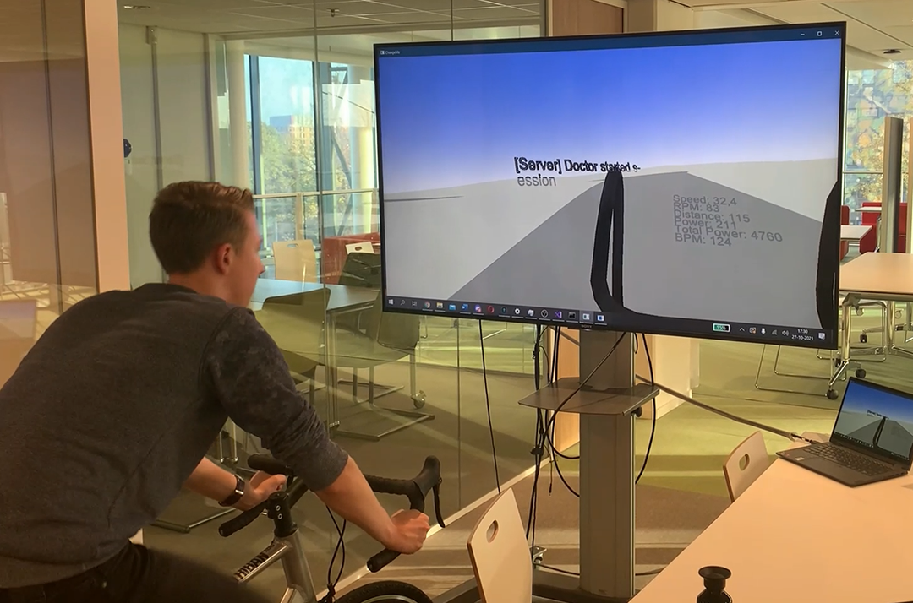
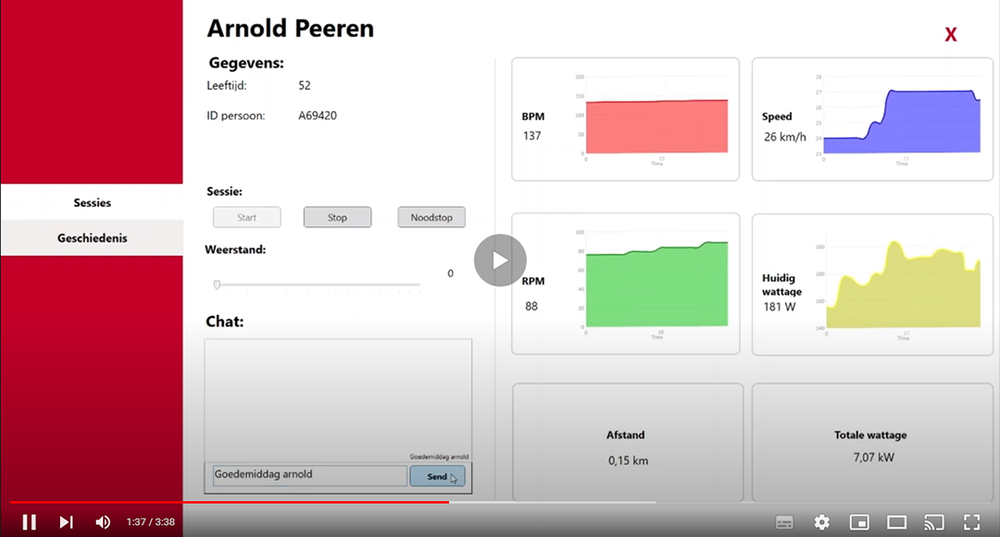

#Remote Healthcare TI2.1

Voor het groepsproject van periode 1 jaar 2 kregen wij een bijzondere opdracht.
Een casus was opgesteld voor de groep om een proof-of-concept te maken.
In 8 weken, met 6 man is er een concept opgesteld. Alle studenten zijn:
- Luuk verhagen
- Lars Hoendevanger
- Imre Fien
- Teun Leenders
- Twan van Noorloos
- Jesse Krijgsman

### Kenissen:
- Samenwerken in groepsverband
- C#
- Client-Server-Client
- Veiligheid en beveiliging
- Draadloze hardware communication (Ergometer + HR-meter)

### De casus:
In de tijd van covid-19 is het lastig om reguliere zorg door te laten gaan. Daarom moet er een systeem komen waarmee een 
dokter op afstand uithoudingsvermogen testen kan uitvoeren. Hier zijn wij mee aan de slag gegaan.

---

---
### Product
Na het doorspitten van documentatie, het werken aan alle aspecten staat er een prachtig product.

In dit project kwamen veel verschillende zaken bij elkaar. Hoe zorg je dat je via BLE de verschillende sensoren kan uitlezen?
Dit betekend dus de documentatie induiken! Communicatie via client-server stond in dit project centraal.
Zeker met deze casus waar veiligheid belangrijk is hebben wij gekeken naar verschillende soorten encryptie en hashing.
Hoe ziet de communicatie tussen server en clients er uit? Hoe doe je dat veilig? Efficient? Allemaal vragen die wij in dit project
hebben behandeld.

---
Bekijk de video opgenomen voor de oplevering voor alle aspecten:

of https://youtu.be/HwgtcwjB-pQ

